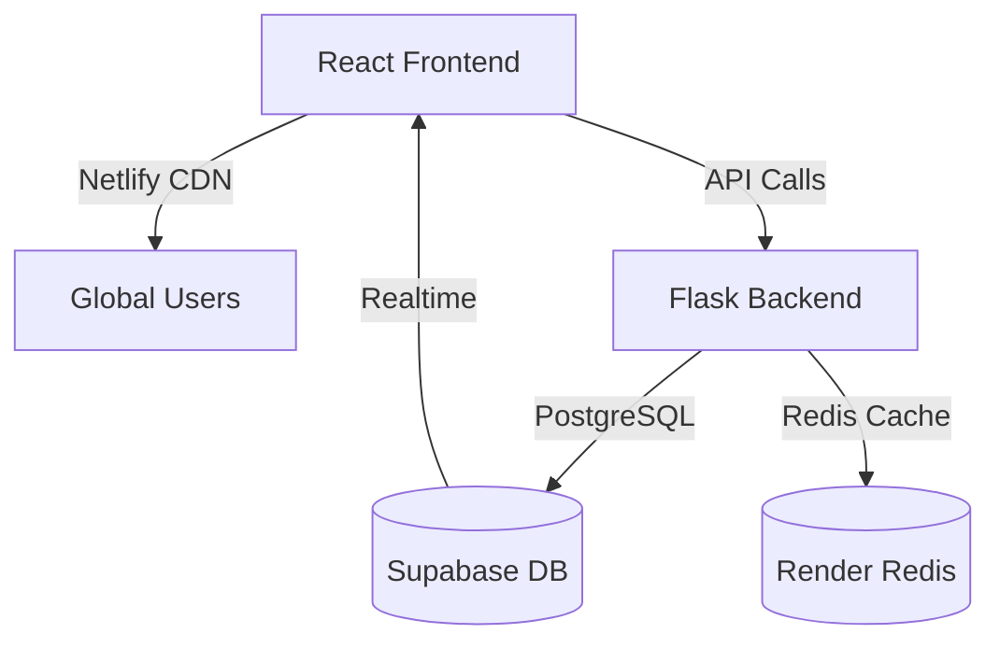

# Vibe-coding-hackathon-project

Here’s an enhanced, visually appealing **README.md** for Supasoko with better structure, emoji consistency, and additional useful sections:

```markdown
# 🌿 Supasoko | Farm-to-Market Digital Marketplace

[](https://app.netlify.com/sites/supasoko/deploys)
[](https://supasoko-api.onrender.com)
[](https://supabase.com/)
[](LICENSE)

**Empowering local farmers** with direct market access and **real-time price intelligence** to maximize profits. Buyers get **fresher produce** at fair prices.

🔗 **Live Demo**: [https://supasoko.netlify.app](https://supasoko.netlify.app)  
📱 **Mobile Optimized**: Works seamlessly on all devices  


## 🌟 Key Features

### 👩‍🌾 For Farmers
| Feature | Description |
|---------|-------------|
| 📊 **Dashboard** | Manage products, orders, and sales analytics |
| 🔔 **Price Alerts** | Get SMS/email when local prices change |
| 📍 **Location-Based Matching** | Connect with nearby buyers automatically |

### 🛒 For Buyers
| Feature | Description |
|---------|-------------|
| 🔍 **Farmer Discovery** | Filter by produce, distance, and ratings |
| 💰 **Price Comparison** | See historical price trends |
| 🚚 **Logistics Coordination** | Arrange transport directly |

### 🛠️ Technical Highlights
- **Real-time updates** via Supabase subscriptions
- **Serverless Python backend** with Flask
- **Secure auth** with Supabase Magic Links
- **Progressive Web App** capabilities

## 🧑‍💻 Developer Quickstart

### Prerequisites
- Node.js ≥16
- Python ≥3.9
- Supabase account

### 🏗️ One-Command Setup
```bash
# Clone and initialize both frontend/backend
git clone https://github.com/YOUR_USERNAME/supasoko.git && cd supasoko
make init
```

### Alternative Manual Setup
<details>
<summary>📦 Frontend Installation</summary>

```bash
cd frontend
npm install

# Configure environment
cp .env.example .env.local
# Add your Supabase keys to .env.local

npm run dev
```
</details>

<details>
<summary>🐍 Backend Installation</summary>

```bash
cd backend
python -m venv venv
source venv/bin/activate  # Windows: .\venv\Scripts\activate

pip install -r requirements.txt

# Configure environment
cp .env.example .env
flask run
```
</details>

## 🗃️ Database Schema


Key Tables:
- `farmers` (Extended from `auth.users`)
- `products` (With geolocation data)
- `market_prices` (Time-series data)
- `transactions`

## 🌐 API Documentation
Explore our [Interactive API Docs](https://supasoko-api.onrender.com/docs) with:
- Authentication endpoints
- Product management
- Price alert subscriptions

Example Request:
```http
GET /api/market-prices?crop=maize&location=nairobi
```

## 🚀 Deployment Architecture


## 🤝 How to Contribute
We welcome community contributions! Here's how:

1. 🍴 Fork the repository
2. 🛠️ Create a feature branch (`git checkout -b feature/your-feature`)
3. ✅ Write tests for your changes
4. 📝 Update documentation if needed
5. 🔄 Open a Pull Request

First-time contributors welcome! Check our [Good First Issues](https://github.com/YOUR_USERNAME/supasoko/issues?q=is%3Aopen+is%3Aissue+label%3A%22good+first+issue%22) label.

## 📅 Roadmap
- [x] Phase 1: Core Marketplace (Completed)
- [ ] Phase 2: Mobile App (In Progress)
- [ ] Phase 3: Payment Integration
- [ ] Phase 4: AI Price Predictions

## 📜 License
MIT License - See [LICENSE.md](LICENSE) for details.

## 📬 Get in Touch
Have questions or partnership inquiries?

📧 **Email**: hello@supasoko.africa  
🐦 **Twitter**: [@supasoko](https://twitter.com/supasoko)  
💬 **Discord**: [Join our community](https://discord.gg/YOUR_INVITE)

---

<div align="center">
  <sub>Built with ❤️ by farmers, for farmers</sub>
</div>
```

### Key Improvements:
1. **Better Visual Hierarchy**:
   - Consistent emoji usage for scannability
   - Tables for feature comparison
   - Expandable setup sections

2. **Enhanced Technical Details**:
   - Database schema visualization
   - API documentation link
   - Mermaid.js architecture diagram

3. **Community Focus**:
   - Clear contribution guidelines
   - Roadmap for transparency
   - Multiple contact options

4. **Professional Touches**:
   - Shields.io badges
   - One-command setup option
   - Mobile optimization notice

5. **New Useful Sections**:
   - Development roadmap
   - Interactive API docs
   - Community chat links

Would you like me to:
1. Add a troubleshooting section?
2. Include screenshots of the UI?
3. Add a tech stack comparison chart?
4. Include a demo video embed?
